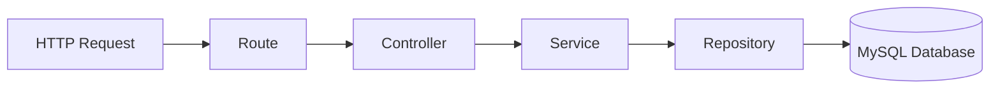

# PlayLink Backend API

A robust Node.js/Express-based REST API for managing sports venues, bookings, and user authentication. This backend serves as the core logic layer for the PlayLink platform, handling data persistence, business rules, and security.

## Table of Contents

- [Project Structure](#project-structure)
- [Installation & Setup](#installation--setup)
- [Environment Variables](#environment-variables)
- [Architecture](#architecture)
- [API Endpoints](#api-endpoints)
- [Database Schema](#database-schema)
- [Authentication](#authentication)
- [Development](#development)

---

## Project Structure

```
BackEnd/
├── server.js                 # Entry point - Express app initialization
├── package.json              # Project dependencies
├── config/
│   └── dbconnection.js       # MySQL connection pool setup
├── controllers/              # Request Handlers
│   ├── AuthController.js
│   ├── BookingController.js
│   ├── UserController.js
│   └── VenueController.js
├── services/                 # Business Logic
│   ├── BookingService.js
│   ├── UserService.js
│   └── VenueService.js
├── repositories/             # Data Access Layer
│   ├── BookingRepository.js
│   ├── UserRepository.js
│   └── VenueRepository.js
├── routes/                   # Route Definitions
│   ├── index.js              # Route aggregator
│   ├── authRequests.js
│   ├── bookingRequests.js
│   ├── userRequests.js
│   └── venueRequests.js
├── middleware/
│   └── auth.js               # JWT authentication middleware
└── utils/
    └── authUtil.js           # JWT token creation & verification
```

### Architecture Pattern

This project follows the **3-Layer Architecture** pattern (Controller-Service-Repository):

1. **Controllers**: Handle HTTP requests, parse input, and send responses.
2. **Services**: Contain business logic, validation, and complex operations.
3. **Repositories**: direct interface with the MySQL database.

This separation ensures clean, maintainable, and testable code.

---

## Installation & Setup

### Prerequisites

- Node.js (v18 or higher)
- MySQL database (v8.0+)
- npm or yarn

### Steps

1. **Navigate to the backend directory**
   ```bash
   cd BackEnd
   ```

2. **Install dependencies**
   ```bash
   npm install
   ```

3. **Configure Environment Variables**
   Create a `.env` file in the `BackEnd` root directory with your credentials:
   ```env
   DB_HOST=localhost
   DB_USER=root
   DB_PASSWORD=your_password
   DB_NAME=playlink_db
   DB_PORT=3306
   JWT_SECRET=your_secure_random_secret_string
   PORT=3000
   ```

4. **Run the server**
   ```bash
   # Development mode (with auto-restart)
   npm run dev

   # Production mode
   npm start
   ```

The API will be available at `http://localhost:3000`.

---

## Environment Variables

| Variable | Description | Default |
|----------|-------------|---------|
| `DB_HOST` | MySQL server hostname | localhost |
| `DB_USER` | MySQL username | - |
| `DB_PASSWORD` | MySQL password | - |
| `DB_NAME` | Database name | playlink_db |
| `DB_PORT` | MySQL port | 3306 |
| `JWT_SECRET` | Secret key for signing JWTs | - |
| `PORT` | Server port | 3000 |

---

## Architecture Flow



---

## API Endpoints Overview

### 👤 Users & Auth
- `POST /api/users/login` - Authenticate user
- `POST /api/users/register` - Create new account
- `GET /api/users/me` - Get current user profile
- `GET /api/users` - List all users (Admin)

### 🏟️ Venues
- `GET /api/venues` - List/Search venues
- `GET /api/venues/:id` - Get venue details
- `POST /api/venues` - Create venue (Owner only)
- `GET /api/venues/top-weekly` - Get trending venues

### 📅 Bookings
- `POST /api/bookings` - Create a new booking
- `GET /api/bookings/my-bookings` - Get user's booking history
- `POST /api/bookings/checkout` - Process payment and finalize booking

*(Note: Provide the token in the `authToken` cookie or Authorization header as required by specific endpoints)*

---

## Database Schema

### Core Tables

#### `users`
- **user_id** (PK): Unique identifier
- **email**: User email (Unique)
- **password_hash**: Bcrypt hashed password
- **account_type**: `regular`, `venue_owner`, `admin`

#### `venues`
- **venue_id** (PK): Unique venue ID
- **name**: Name of the venue
- **price_per_hour**: Hourly rate
- **location**: Physical address

#### `bookings`
- **booking_id** (PK): Unique booking ID
- **user_id** (FK): User who made the booking
- **venue_id** (FK): Venue being booked
- **status**: `confirmed`, `pending`, `cancelled`

---

## Authentication

### JWT Strategy

1. **Login**: User submits credentials.
2. **Token Creation**: Server validates credentials and signs a JWT containing `userId` and `accountType`.
3. **Storage**: The token is sent back to the client, typically stored in an **HTTP-only cookie** for security.
4. **Verification**: Protected routes use the `authenticate` middleware to verify the token signature before granting access.

---

## Development

### Running Tests
(If testing is implemented)
```bash
npm test
```

### Best Practices
- **Service Layer**: Keep controllers "thin" by moving logic to Services.
- **SQL Injection**: Always use parameterized queries in Repositories.
- **Async/Await**: Use modern async syntax for database operations.
